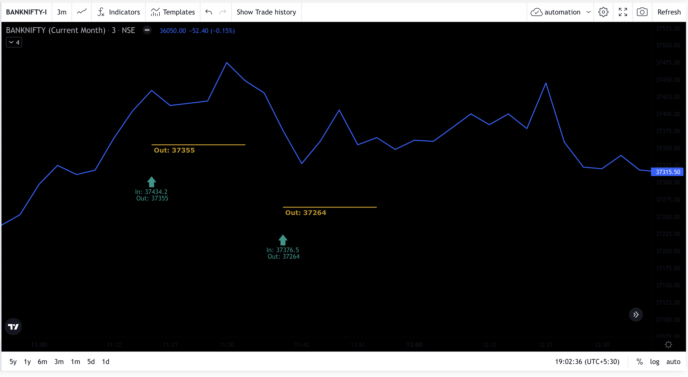
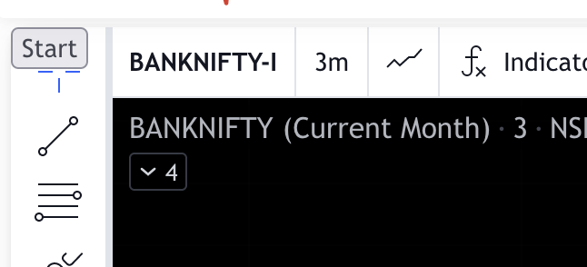

# oipulse-alerting
Alerts when trending oi data reaches to specified threshold

Sound used in this code is taken from the show `Silicon Valley`
Youtube: https://www.youtube.com/watch?v=uS1KcjkWdoU

### Install all python packages in requirements.txt
```bash
pip install -r requirements.txt
```


### Environment file setup for trending OI alerting

```
Define environment variables in .env file

Example: 

AUTH_TOKEN="<your_token_here>" # Get Auth token from oi pulse website after login
EXPIRY="211202" # Expiry in format YYMMDD
TIME_FRAME=5  # Time frame for calculation 3, 5, 10, 15, 30 or 60
DIFF_THRESHOLD=3000000  # Trending OI Difference threshold for alert
```

### Load environment variables in your shell

```bash
export `cat .env | xargs`
```

### Running the script
```
./run_scripts/trending_oi_alerts.sh
```

### Notes
1. ```trending_oi.py``` script generates the alert only when threshold oi difference is reached
2. Calculations can be little different from trending oi user interface due to different timestamp used
3. Can use any timeframe for alerting and data will be fetched at particular given intervals for oi difference calculation.


## OSPL Signal Alerting

1. This is a temporary solution implemented using tamper monkey extension and pytesseract python package
2. It detects the signal based upon image quality and clarity but not 100% perfect though
3. Limitations include unable to read if 2 signals overlap on each other but still alert will come based upon new entry number detected
4. Also, signals are best detected when background is black on chart

### How to use OSPL signal script?

1. First install the tamper monkey script on firefox,
2. Open advance charts and do settings as per image show below
3. Click Start/Stop button on top left corner to start/Stop capturing the canvas images
4. Run the python script ```./run_scripts/ospl_signal_alerts.sh```
5. Change the download file location in firefox to location of this project stored in our machine
6. Change the setting to directly allow downloading file without prompt in firefox

### Advance Chart settings and Start/Stop button:






### OSPL Signal Alerting working explanation:

1. It collects the canvas images at 4 second interval using tamper monkey script on firefox
2. Canvas images are stored directly into project folder filename ```ospl_image.txt```
3. Python script uses this canvas image to OCR signal data using pytesseract package
4. Current day fetched signals are saved in filename ```signals_<current_date>.txt```
5. Alerts are generated with 2 seconds delay and only if tesseract detects any new signal.

**Not a perfect solution but a good workaround :)


Note: code tested only on MacOS, feel free to contribute :)

